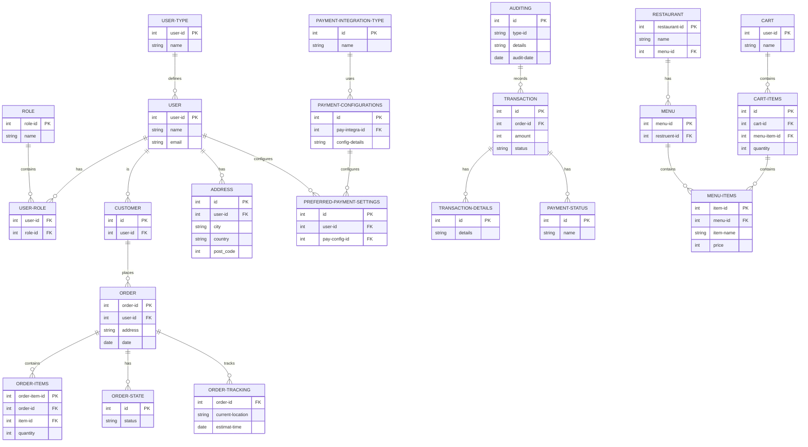

# Foodlify Database ERD

```mermaid
erDiagram
	direction TB
	RESTAURANT {
		int restaurant-id PK ""  
		string name  ""  
		int menu-id FK ""  
	}

	MENU {
		int menu-id PK ""  
		int restruent-id FK ""  
	}

	PAYMENT-INTEGRATION-TYPE {
		int id PK ""  
		string name  ""  
	}

	USER-TYPE {
		int user-id PK ""  
		string name  ""  
	}

	ROLE {
		int role-id PK ""  
		string name  ""  
	}

	USER-ROLE {
		int user-id FK ""  
		int role-id FK ""  
	}

	CUSTOMER {
		int id PK ""  
		int user-id FK ""  
	}

	ADDRESS {
		int id PK ""  
		int user-id FK ""  
		string city  ""  
		string country  ""  
		int post_code  ""  
	}

	ORDER {
		int order-id PK ""  
		int user-id FK ""  
		string address  ""  
		date date  ""  
	}

	ORDER-ITEMS {
		int order-item-id PK ""  
		int order-id FK ""  
		int item-id FK ""  
		int quantity  ""  
	}

	ORDER-STATE {
		int id PK ""  
		string status  ""  
	}

	ORDER-TRACKING {
		int order-id FK ""  
		string current-location  ""  
		date estimat-time  ""  
	}

	PREFERRED-PAYMENT-SETTINGS {
		int id PK ""  
		int user-id FK ""  
		int pay-config-id FK ""  
	}

	PAYMENT-CONFIGURATIONS {
		int id PK ""  
		int pay-integra-id FK ""  
		string config-details  ""  
	}

	AUDITING {
		int id PK ""  
		string type-id  ""  
		string details  ""  
		date audit-date  ""  
	}

	TRANSACTION {
		int id PK ""  
		int order-id FK ""  
		int amount  ""  
		string status  ""  
	}

	TRANSACTION-DETAILS {
		int id PK ""  
		string details  ""  
	}

	PAYMENT-STATUS {
		int id PK ""  
		string name  ""  
	}

	CART {
		int user-id PK ""  
		string name  ""  
	}

	CART-ITEMS {
		int id PK ""  
		int cart-id FK ""  
		int menu-item-id FK ""  
		int quantity  ""  
	}

	MENU-ITEMS {
		int item-id PK ""  
		int menu-id FK ""  
		string item-name  ""  
		int price  ""  
	}

	USER {
		int user-id PK ""  
		string name  ""  
		string email  ""  
	}

	RESTAURANT||--o{MENU:"has"
	USER-TYPE||--o{USER:"defines"
	ROLE||--o{USER-ROLE:"contains"
	USER||--o{USER-ROLE:"has"
	USER||--o{CUSTOMER:"is"
	USER||--o{ADDRESS:"has"
	USER||--o{PREFERRED-PAYMENT-SETTINGS:"configures"
	CUSTOMER||--o{ORDER:"places"
	ORDER||--o{ORDER-ITEMS:"contains"
	ORDER||--o{ORDER-STATE:"has"
	ORDER||--o{ORDER-TRACKING:"tracks"
	MENU||--o{MENU-ITEMS:"contains"
	PAYMENT-INTEGRATION-TYPE||--o{PAYMENT-CONFIGURATIONS:"uses"
	PAYMENT-CONFIGURATIONS||--o{PREFERRED-PAYMENT-SETTINGS:"configures"
	AUDITING||--o{TRANSACTION:"records"
	TRANSACTION||--o{TRANSACTION-DETAILS:"has"
	TRANSACTION||--o{PAYMENT-STATUS:"has"
	CART||--o{CART-ITEMS:"contains"
	CART-ITEMS||--o{MENU-ITEMS:"contains"
```
